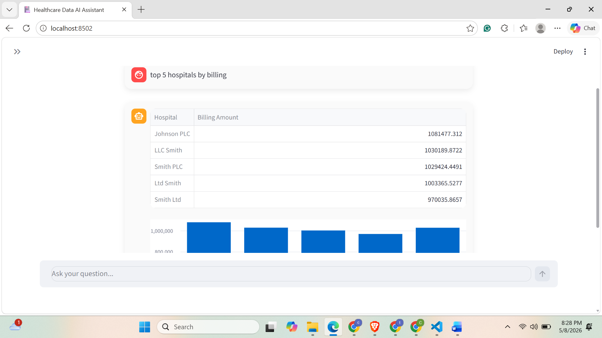

# 🏥 MediQuery AI
Live Demo (Local): Run using Streamlit

MediQuery AI is an AI-powered data assistant that allows users to ask questions in natural language and instantly get insights from structured healthcare datasets.

It leverages a local Large Language Model (LLM) via Ollama to translate user queries into pandas code and executes them safely to return accurate results.

## 🚧 Project Status

This project is actively being improved and will continue to evolve over time.

Current work focuses on improving query accuracy, strengthening validation, expanding supported analytics, and making the assistant more reliable for real-world data exploration use cases.

## App Preview



The current version is a working MVP, and future updates will continue to enhance performance, usability, and analytical capabilities.
---

## 🚀 Features

* Natural language querying on structured healthcare data
* Converts user questions into pandas operations using LLM
* Safe execution engine to prevent arbitrary code execution
* Supports:

  * Aggregations (mean, max, min, sum)
  * Grouping and comparisons
  * Top-N queries
  * Row-level queries (e.g., “who stayed longest”)
* Interactive chat-based UI built with Streamlit
* Fully local setup (no paid APIs required)

---

## 🧠 How It Works

1. User enters a question in plain English
2. LLM (Ollama) converts the question into pandas code
3. The system validates and cleans the generated code
4. Code is executed safely using a restricted environment
5. Results are displayed in a clean UI (table/chart)

---

## 💻 Tech Stack

* Python
* Pandas
* Streamlit
* Ollama (Local LLM)
* LangChain (LLM integration)

---

## 📊 Example Queries

You can ask questions like:

* average billing amount
* who stayed longest
* top 5 hospitals by billing
* billing by insurance provider
* how admission type varies with medical condition
* which patient has lowest billing amount

---

## ⚙️ Installation & Setup

### 1. Clone the repository

```bash
git clone https://github.com/YOUR_USERNAME/MediQuery-AI.git
cd MediQuery-AI
```

---

### 2. Install dependencies

```bash
pip install streamlit pandas langchain-community
```

---

### 3. Install and run Ollama

Download Ollama:
https://ollama.com/download

Run the model:

```bash
ollama run phi3
```

---

### 4. Run the application

```bash
python -m streamlit run app.py
```

---

## 🛡️ Safety Design

This project includes a **safe execution layer** to prevent harmful code execution:

* Only allows operations on the dataframe (`df`)
* Blocks unsafe operations (e.g., file access, imports)
* Executes code in a restricted environment

---

## ⚠️ Limitations

* Works best with structured, clear questions
* Complex or ambiguous queries may fail
* Dependent on small local LLM (phi3), so reasoning is limited
* Not a replacement for full BI tools (yet)

---

## 🔮 Future Improvements

* Better query understanding and parsing
* Support for more complex analytics (joins, filters, multi-step queries)
* Improved UI/UX (charts, dashboards)
* Deploy as a hosted web application
* Add memory/context for multi-turn conversations

---

## 📌 Why This Project Matters

This project demonstrates how LLMs can be integrated with traditional data tools like pandas to build intelligent data analysis systems.

It highlights:

* Prompt engineering for structured outputs
* Safe execution of LLM-generated code
* Real-world AI application in data analytics

---

## 👨‍💻 Author

Chandrika Thatipaka

---

## ⭐ If you found this useful

Give it a star ⭐ on GitHub!
